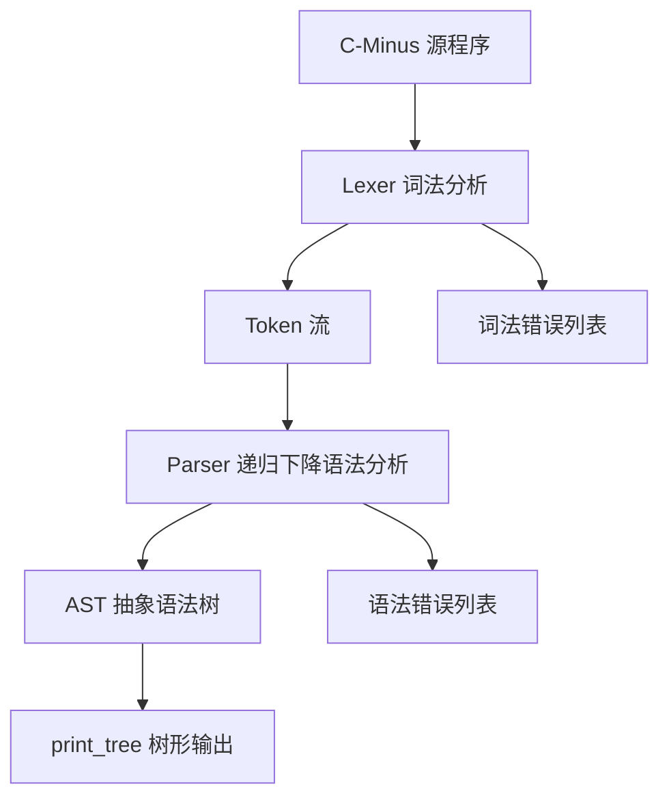
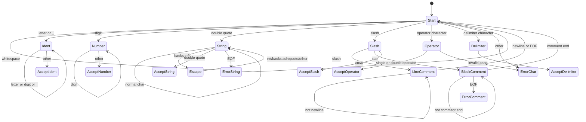
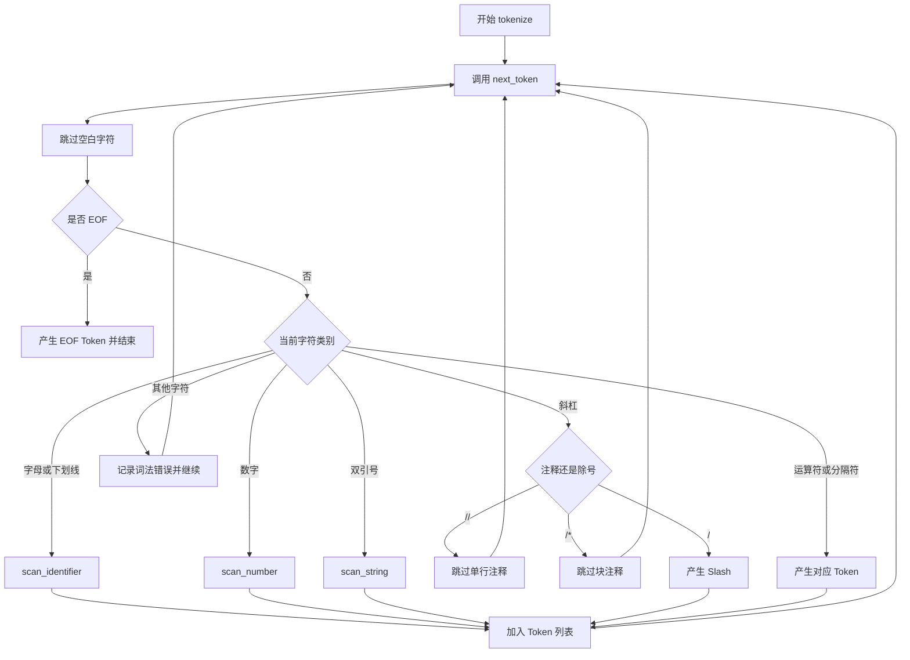
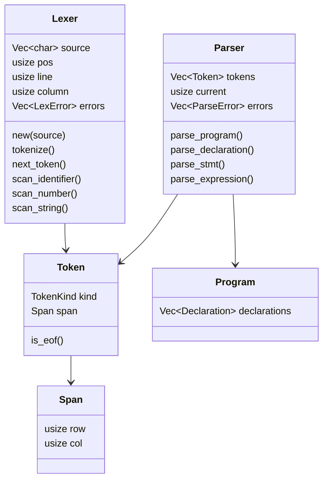

# C-Minus 编译器词法分析与语法分析课程设计报告

## 课题名称

C-Minus 语言编译器前端的设计与实现：词法分析与语法分析

## 1. 课程设计目标

### 1.1 题目实用性

C-Minus 是 C 语言的一个教学子集，保留了变量声明、数组、函数、条件语句、循环语句、返回语句、表达式和函数调用等核心结构。以 C-Minus 为对象实现编译器前端，既能覆盖编译原理课程中的词法分析、语法分析、抽象语法树和错误恢复等重点内容，又不会被完整 C 语言中过于复杂的类型系统和预处理机制分散注意力。

本课题的实用意义主要体现在：

1. 通过词法分析器将源程序转化为 Token 流，为后续语法分析和语义分析提供统一输入。
2. 通过递归下降语法分析器将 Token 流转化为 AST，体现从线性文本到结构化程序表示的转换过程。
3. 通过错误收集与恢复机制，使编译器能够一次运行报告多个错误，改善编译器工具的可用性。
4. 使用 Rust 实现编译器前端，利用枚举、模式匹配和所有权机制表达 Token、AST、错误类型等结构，代码安全性和可维护性较好。

### 1.2 课程设计要求

本设计实现 C-Minus 编译器前端中的两个实验部分：

1. 词法分析实验：识别关键字、标识符、数字、字符串、运算符、分隔符、注释和文件结束符，并记录 Token 的行列位置。
2. 语法分析实验：根据 C-Minus 文法实现递归下降分析器，支持声明、函数、参数、复合语句、if/else、while、return、赋值、算术表达式、关系表达式、数组访问和函数调用。
3. 错误处理：词法分析阶段收集非法字符、未闭合注释、未闭合字符串、未知转义等错误；语法分析阶段收集缺失分号、缺失括号、缺失类型、缺失标识符等错误。
4. 测试验证：使用单元测试和示例程序验证正常程序、边界情况和错误恢复能力。

### 1.3 设计目标

本项目的具体目标如下：

1. 设计清晰的 Token 类型系统，准确描述 C-Minus 语言的词法单元。
2. 使用有限自动机思想完成扫描过程，实现可恢复的词法分析器。
3. 将原始 BNF 文法改写为适合递归下降的 EBNF 文法，消除左递归。
4. 构建 AST 节点类型，使语法分析结果能够表示完整程序结构。
5. 实现错误恢复策略，保证遇到错误时尽量继续分析后续输入。
6. 编写覆盖关键功能的测试用例，并用完整 GCD 程序展示词法和语法分析结果。

## 2. 分析与设计

### 2.1 系统设计思想

系统采用分阶段编译器前端结构。词法分析器负责将源代码字符流转换为 Token 序列；语法分析器负责读取 Token 序列并构建 AST；AST 打印模块用于展示语法树，便于调试和实验报告呈现。



项目核心目录如下：

```text
src/
├── lexer/
│   ├── mod.rs       词法分析器主体
│   ├── token.rs     Token、TokenKind、Span 定义
│   ├── error.rs     词法错误定义
│   └── tests.rs     词法分析单元测试
├── parser/
│   ├── mod.rs       递归下降语法分析器主体
│   ├── ast.rs       AST 节点定义
│   ├── error.rs     语法错误定义
│   ├── print.rs     AST 树形打印
│   └── tests.rs     语法分析单元测试
└── lib.rs           库模块入口
```

### 2.2 DFA 设计

词法分析器可抽象为一个确定有限自动机。扫描器从起始状态根据当前字符类别进入不同状态，最终产生 Token 或记录错误。



识别规则如下：

1. 关键字：`if`、`else`、`while`、`return`、`void`、`int`。
2. 标识符：以字母或 `_` 开头，后接字母、数字或 `_`。
3. 数字：连续十进制数字，转换为 `i64`。
4. 字符串：双引号包围，支持 `\n`、`\t`、`\\`、`\"` 转义。
5. 注释：支持 `//` 单行注释和 `/* ... */` 块注释。
6. 运算符：支持算术、关系、赋值和不等号运算符。
7. 分隔符：支持分号、逗号、括号、花括号和方括号。

### 2.3 程序流程图

词法分析流程如下：



语法分析流程如下：

```mermaid
flowchart TD
    A["parse_program"] --> B{"当前是否 EOF"}
    B -->|是| C["返回 Program"]
    B -->|否| D["parse_declaration"]
    D --> E{"声明解析成功"}
    E -->|是| F["加入 declarations"]
    E -->|否| G["synchronize 错误恢复"]
    F --> B
    G --> B

    D --> H["parse_type_spec"]
    H --> I["expect_identifier"]
    I --> J{"后继 Token"}
    J -->|;| K["变量声明"]
    J -->|[ NUM ] ;| L["数组声明"]
    J -->|( params ) compound| M["函数声明"]
```

表达式解析按优先级分层：

```text
expression
  -> simple-expression 或 lvar = expression
simple-expression
  -> additive-expression [relop additive-expression]
additive-expression
  -> term {(+|-) term}
term
  -> factor {(*|/) factor}
factor
  -> (expression) | ID factor-tail | NUM | STRING
```

### 2.4 数据结构与模块设计

本项目使用 Rust 的模块、结构体和枚举完成设计，不采用传统面向对象继承层次。主要结构如下：



各文件设计说明：

| 文件 | 作用 |
|------|------|
| `src/lexer/token.rs` | 定义 `Span`、`TokenKind`、`Token`，负责表示词法单元及其源代码位置。 |
| `src/lexer/error.rs` | 定义 `LexError`，保存词法错误信息和发生位置。 |
| `src/lexer/mod.rs` | 实现 `Lexer`，负责字符读取、跳过空白与注释、识别标识符、数字、字符串、运算符和分隔符。 |
| `src/parser/ast.rs` | 定义 AST 节点，包括程序、声明、语句、表达式、左值和运算符。 |
| `src/parser/error.rs` | 定义 `ParseErrorKind` 和 `ParseError`，描述不同类型的语法错误。 |
| `src/parser/mod.rs` | 实现 `Parser`，每个主要非终结符对应一个解析函数。 |
| `src/parser/print.rs` | 将 AST 以树形文本形式输出，方便观察语法分析结果。 |
| `examples/gcd_test.rs` | 使用 GCD 程序进行词法分析、语法分析和 AST 打印。 |
| `examples/error_test.rs` | 展示词法错误检测与恢复。 |
| `examples/parse_error_test.rs` | 展示语法错误检测与恐慌模式恢复。 |

### 2.5 语法设计

原始 C-Minus 文法中存在左递归，例如：

```text
additive-expression -> additive-expression addop term | term
term -> term mulop factor | factor
```

递归下降分析器不能直接处理左递归，因此本项目将其改写为循环形式：

```text
additive-expression -> term { addop term }
term -> factor { mulop factor }
```

赋值表达式的难点在于 `ID` 开头既可能是普通变量表达式，也可能是赋值语句左侧。实现中先解析为普通表达式，如果得到的是左值且下一个 Token 是 `=`，再构造赋值表达式。

```rust
pub fn parse_expression(&mut self) -> Option<Expression> {
    let expr = self.parse_simple_expression()?;
    if let Expression::LVar(lvar) = &expr {
        if self.matches(&TokenKind::Assign) {
            self.advance();
            let rhs = self.parse_expression()?;
            return Some(Expression::Assign {
                lvar: lvar.clone(),
                expr: Box::new(rhs),
            });
        }
    }
    Some(expr)
}
```

### 2.6 错误恢复设计

词法分析阶段采用“记录错误并继续扫描”的策略。例如遇到非法字符时，将错误加入 `lexer.errors`，然后继续读取下一个 Token。

语法分析阶段采用恐慌模式恢复。解析失败后跳过输入，直到遇到同步点：

```text
同步 Token: ;、)、}、EOF
```

其中 `;` 和 `)` 会被消费，`}` 和 `EOF` 保留给上层结构处理。这样可以避免解析器卡死，并尽量在一次运行中报告多个语法错误。

### 2.7 测试程序说明

测试分为三类：

1. 单元测试：`src/lexer/tests.rs` 和 `src/parser/tests.rs`，覆盖关键字、标识符、数字、字符串、注释、错误恢复、声明、语句、表达式、优先级和完整程序。
2. 正确程序示例：`examples/gcd_test.rs`，输入一个包含 `gcd` 和 `main` 的完整 C-Minus 程序，输出 Token 流和 AST。
3. 错误程序示例：`examples/error_test.rs` 和 `examples/parse_error_test.rs`，分别展示词法错误和语法错误的收集结果。

## 3. 程序代码实现

本节按文件列出主要代码。为突出设计重点，仅列核心结构和关键函数。

### 3.1 `src/lexer/token.rs`

该文件定义 Token 的种类、源代码位置和显示方式。

```rust
pub struct Span {
    pub row: usize,
    pub col: usize,
}

#[derive(Debug, Clone, PartialEq, Eq, Display)]
pub enum TokenKind {
    If, Else, While, Return, Void, Int,
    Identifier(String),
    Number(i64),
    String(String),
    Plus, Minus, Star, Slash,
    Eq, Ne, Assign, Lt, Gt, Le, Ge,
    Semicolon, Comma,
    LParen, RParen, LBrace, RBrace, LBracket, RBracket,
    EOF,
}

impl TokenKind {
    pub fn lookup_keyword(s: &str) -> TokenKind {
        match s {
            "if" => TokenKind::If,
            "else" => TokenKind::Else,
            "while" => TokenKind::While,
            "return" => TokenKind::Return,
            "void" => TokenKind::Void,
            "int" => TokenKind::Int,
            _ => TokenKind::Identifier(s.to_string()),
        }
    }
}

pub struct Token {
    pub kind: TokenKind,
    pub span: Span,
}
```

### 3.2 `src/lexer/error.rs`

该文件定义词法错误结构。每个错误包含错误信息和位置。

```rust
#[derive(Debug, Clone)]
pub struct LexError {
    pub message: String,
    pub span: Span,
}

impl fmt::Display for LexError {
    fn fmt(&self, f: &mut fmt::Formatter<'_>) -> fmt::Result {
        write!(f, "LexError at {}: {}", self.span, self.message)
    }
}
```

### 3.3 `src/lexer/mod.rs`

该文件实现词法分析器主体。`Lexer` 保存字符数组、当前位置、行列号和错误列表。

```rust
pub struct Lexer {
    source: Vec<char>,
    pos: usize,
    line: usize,
    column: usize,
    pub errors: Vec<LexError>,
}
```

底层字符读取函数：

```rust
fn peek(&self) -> Option<char> {
    self.source.get(self.pos).cloned()
}

fn advance(&mut self) -> Option<char> {
    let current_char = self.peek()?;
    self.pos += 1;
    if current_char == '\n' {
        self.line += 1;
        self.column = 1;
    } else {
        self.column += 1;
    }
    Some(current_char)
}
```

标识符和关键字识别：

```rust
pub fn scan_identifier(&mut self) -> Option<Token> {
    let start_span = self.current_span();
    let mut identifier = String::new();

    while let Some(ch) = self.peek() {
        if ch.is_ascii_alphanumeric() || ch == '_' {
            identifier.push(ch);
            self.advance();
        } else {
            break;
        }
    }

    let kind = TokenKind::lookup_keyword(&identifier);
    Some(Token::new(kind, start_span))
}
```

字符串识别与错误处理：

```rust
pub fn scan_string(&mut self) -> Option<Token> {
    let start_span = self.current_span();
    let mut string = String::new();

    self.advance();

    while let Some(ch) = self.advance() {
        match ch {
            '"' => return Some(Token::new(TokenKind::String(string), start_span)),
            '\\' => {
                if let Some(escaped) = self.scan_escape_char(&start_span) {
                    string.push(escaped);
                }
            }
            _ => string.push(ch),
        }
    }

    self.errors
        .push(LexError::new("Unterminated string".to_string(), start_span));
    None
}
```

Token 主调度函数：

```rust
pub fn next_token(&mut self) -> Option<Token> {
    self.skip_whitespace();
    let span = self.current_span();
    let ch = match self.peek() {
        Some(ch) => ch,
        None => return Some(Token::new(TokenKind::EOF, span)),
    };

    if ch.is_ascii_alphabetic() || ch == '_' {
        return self.scan_identifier();
    }

    if ch.is_digit(10) {
        return self.scan_number();
    }

    if ch == '"' {
        return self.scan_string().or_else(|| self.next_token());
    }

    self.advance();
    match ch {
        '+' => Some(Token::new(TokenKind::Plus, span)),
        '-' => Some(Token::new(TokenKind::Minus, span)),
        '*' => Some(Token::new(TokenKind::Star, span)),
        '/' => { /* 判断注释或除号 */ }
        '=' => { /* 判断 = 或 == */ }
        '<' => { /* 判断 < 或 <= */ }
        '>' => { /* 判断 > 或 >= */ }
        '!' => { /* 判断 !=，否则报错 */ }
        ';' => Some(Token::new(TokenKind::Semicolon, span)),
        _ => { /* 非法字符错误恢复 */ }
    }
}
```

### 3.4 `src/parser/ast.rs`

该文件定义 AST。程序由声明列表组成，声明分为变量声明和函数声明，语句与表达式继续向下展开。

```rust
pub enum TypeSpec {
    Int,
    Void,
}

pub struct Program {
    pub declarations: Vec<Declaration>,
}

pub enum Declaration {
    Var(VarDecl),
    Func(FuncDecl),
}

pub struct FuncDecl {
    pub return_type: TypeSpec,
    pub name: String,
    pub params: Vec<Param>,
    pub body: CompoundStmt,
    pub span: Span,
}

pub enum Stmt {
    Expression(Option<Expression>),
    Compound(CompoundStmt),
    Selection(SelectionStmt),
    Iteration(IterationStmt),
    Return(Option<Expression>),
    Empty,
}

pub enum Expression {
    Assign { lvar: LVar, expr: Box<Expression> },
    BinOp { op: BinaryOp, left: Box<Expression>, right: Box<Expression> },
    Call { name: String, args: Vec<Expression>, span: Span },
    LVar(LVar),
    Number(i32),
    String(String),
}
```

### 3.5 `src/parser/error.rs`

该文件定义语法错误类型。错误类型使用枚举表达，便于测试和输出。

```rust
pub enum ParseErrorKind {
    ExpectedToken { expected: TokenKind, found: TokenKind },
    ExpectedIdentifier { found: TokenKind },
    ExpectedNumber { found: TokenKind },
    ExpectedString { found: TokenKind },
    ExpectedTypeSpec { found: TokenKind },
    ExpectedFactor { found: TokenKind },
    ExpectedDeclTail { found: TokenKind },
    ArraySizeTooLarge { value: i64, max: u32 },
    MissingRBrace,
}

pub struct ParseError {
    pub kind: ParseErrorKind,
    pub span: Span,
}
```

### 3.6 `src/parser/mod.rs`

该文件是语法分析器主体。`Parser` 维护 Token 列表、当前下标和错误列表。

```rust
pub struct Parser {
    tokens: Vec<Token>,
    current: usize,
    pub errors: Vec<ParseError>,
}
```

基础操作：

```rust
pub fn peek(&self) -> &TokenKind {
    self.tokens
        .get(self.current)
        .map(|token| &token.kind)
        .unwrap_or(&TokenKind::EOF)
}

pub fn advance(&mut self) -> &Token {
    let token = self.tokens.get(self.current).unwrap();
    if self.current < self.tokens.len() - 1 {
        self.current += 1;
    }
    token
}

pub fn expect(&mut self, expected: TokenKind) -> Option<Token> {
    if self.matches(&expected) {
        Some(self.advance().clone())
    } else {
        let found = self.peek().clone();
        self.error(ParseErrorKind::ExpectedToken { expected, found })
    }
}
```

程序和声明解析：

```rust
pub fn parse_program(&mut self) -> Program {
    let mut declarations = Vec::new();

    while !self.matches(&TokenKind::EOF) {
        let pos = self.current;
        if let Some(decl) = self.parse_declaration() {
            declarations.push(decl);
        } else if self.current == pos {
            self.advance();
        }
    }
    Program { declarations }
}

pub fn parse_declaration(&mut self) -> Option<Declaration> {
    let type_spec = self.parse_type_spec()?;
    let name = self.expect_identifier()?;

    match self.peek() {
        TokenKind::Semicolon => { /* 变量声明 */ }
        TokenKind::LBracket => { /* 数组声明 */ }
        TokenKind::LParen => { /* 函数声明 */ }
        _ => { /* 声明尾部错误 */ }
    }
}
```

语句解析：

```rust
pub fn parse_stmt(&mut self) -> Option<Stmt> {
    match self.peek() {
        TokenKind::If => self.parse_selection_stmt(),
        TokenKind::While => self.parse_iteration_stmt(),
        TokenKind::Return => self.parse_return_stmt(),
        TokenKind::LBrace => {
            let compound = self.parse_compound_stmt()?;
            Some(Stmt::Compound(compound))
        }
        TokenKind::Semicolon => {
            self.advance();
            Some(Stmt::Empty)
        }
        _ => self.parse_expression_stmt(),
    }
}
```

表达式解析：

```rust
pub fn parse_additive_expression(&mut self) -> Option<Expression> {
    let mut left = self.parse_term()?;

    while matches!(self.peek(), TokenKind::Plus | TokenKind::Minus) {
        let op = match self.peek() {
            TokenKind::Plus => BinaryOp::Add,
            TokenKind::Minus => BinaryOp::Sub,
            _ => unreachable!(),
        };
        self.advance();
        let right = self.parse_term()?;
        left = Expression::BinOp {
            op,
            left: Box::new(left),
            right: Box::new(right),
        };
    }
    Some(left)
}
```

错误同步：

```rust
fn synchronize(&mut self) {
    while !matches!(
        self.peek(),
        TokenKind::Semicolon | TokenKind::RParen | TokenKind::RBrace | TokenKind::EOF
    ) {
        self.advance();
    }
    match self.peek() {
        TokenKind::Semicolon | TokenKind::RParen => {
            self.advance();
        }
        TokenKind::RBrace | TokenKind::EOF => {}
        _ => unreachable!(),
    }
}
```

### 3.7 `src/parser/print.rs`

该文件将 AST 转为树形文本输出。主要入口如下：

```rust
pub fn print_tree(program: &Program) -> String {
    let mut lines: Vec<String> = Vec::new();
    for (i, decl) in program.declarations.iter().enumerate() {
        let is_last = i == program.declarations.len() - 1;
        print_declaration(decl, "", is_last, &mut lines);
    }
    lines.join("\n")
}
```

为了保证运算符显示稳定，打印模块使用显式映射：

```rust
fn op_str(op: &BinaryOp) -> &'static str {
    match op {
        BinaryOp::Add => "+",
        BinaryOp::Sub => "-",
        BinaryOp::Mul => "*",
        BinaryOp::Div => "/",
        BinaryOp::Eq => "==",
        BinaryOp::Ne => "!=",
        BinaryOp::Lt => "<",
        BinaryOp::Gt => ">",
        BinaryOp::Le => "<=",
        BinaryOp::Ge => ">=",
    }
}
```

## 4. 测试结果

### 4.1 测试数据选择

测试数据覆盖如下类别：

| 类别 | 示例 | 目的 |
|------|------|------|
| 空输入与空白输入 | `""`、空格、换行、制表符 | 验证 EOF 和空白跳过逻辑 |
| 关键字 | `if else while return void int` | 验证关键字识别 |
| 标识符 | `x`、`abc123`、`_temp` | 验证标识符规则 |
| 数字 | `0`、`123`、大整数 | 验证数字扫描 |
| 字符串 | `"hello"`、`"a\nb"` | 验证字符串和转义 |
| 注释 | `// comment`、`/* block */` | 验证注释跳过 |
| 运算符 | `+ - * / == != < <= > >= =` | 验证单字符和双字符运算符 |
| 声明 | `int x;`、`int arr[10];` | 验证变量与数组声明 |
| 函数 | `int gcd(int u, int v) { ... }` | 验证函数声明与参数 |
| 语句 | `if`、`while`、`return`、复合语句 | 验证语句解析 |
| 表达式 | `a + b * c`、`x = input();` | 验证优先级和赋值 |
| 错误输入 | 缺少分号、括号、数组大小等 | 验证语法错误恢复 |

完整示例程序为 GCD：

```c
int gcd(int u, int v){
    if(v==0) return u;
    else return gcd(v, u-u/v*v);
}

void main(void){
    int x;int y;
    x=input();
    y=input();
    output(gcd(x,y));
}
```

### 4.2 单元测试结果

执行命令：

```powershell
cargo test
```

结果：

```text
running 118 tests
test result: ok. 118 passed; 0 failed; 0 ignored; 0 measured; 0 filtered out
Doc-tests c_minus
test result: ok. 0 passed; 0 failed; 0 ignored
```

说明：

1. 词法分析测试覆盖基础 Token、比较运算符、注释、复杂表达式、边界情况、错误恢复、标识符、关键字、数字、位置和字符串。
2. 语法分析测试覆盖声明、语句、表达式、二元运算、优先级、嵌套结构、完整程序和语法错误。
3. 测试通过说明词法分析和语法分析的主要功能符合预期。
4. 编译时出现语义分析模块中未使用字段的 warning，这与本报告关注的词法、语法阶段无关，不影响测试通过。

### 4.3 GCD 示例测试结果

执行命令：

```powershell
cargo run --example gcd_test
```

词法分析结果摘要：

```text
[  2:1  ] INT
[  2:5  ] ID(gcd)
[  2:8  ] LPAREN
[  2:9  ] INT
[  2:13 ] ID(u)
[  2:14 ] COMMA
[  2:16 ] INT
[  2:20 ] ID(v)
...
[ 11:21 ] SEMICOLON
[ 12:1  ] RBRACE
[ 13:1  ] EOF
```

运行结果：

```text
✓ 没有词法错误
总 Token 数: 71 (包括 EOF)
✓ 没有语法错误
```

AST 输出摘要：

```text
├──FuncK: gcd -> int
│   ├──ReturnType: int
│   ├──ParamsK
│   │   ├──ParamK: u int
│   │   └──ParamK: v int
│   └──CompK
│       └──IfK
│           ├──CondK
│           │   └──OpK: ==
│           │       ├──IdK: v
│           │       └──ConstK: 0
│           ├──ThenK
│           │   └──ReturnK
│           │       └──IdK: u
│           └──ElseK
│               └──ReturnK
│                   └──CallK: gcd
│                       └──ArgsK
│                           ├──IdK: v
│                           └──OpK: -
│                               ├──IdK: u
│                               └──OpK: *
│                                   ├──OpK: /
│                                   │   ├──IdK: u
│                                   │   └──IdK: v
│                                   └──IdK: v
└──FuncK: main -> void
    ├──ReturnType: void
    ├──ParamsK: VoidK
    └──CompK
        ├──VarDeclK: x int
        ├──VarDeclK: y int
        ├──ExprK
        │   └──AssignK: x
        │       └──CallK: input
        ├──ExprK
        │   └──AssignK: y
        │       └──CallK: input
        └──ExprK
            └──CallK: output
```

结果分析：

1. Token 行列号正确反映了源程序中的位置，例如 `gcd` 位于第 2 行第 5 列。
2. `v==0` 被识别为标识符、等号运算符和数字，说明双字符运算符识别正确。
3. `u-u/v*v` 的 AST 体现了乘除优先于加减，且同级运算按左结合处理。
4. `input()` 和 `output(gcd(x,y))` 被识别为函数调用，嵌套调用结构正确。
5. `main(void)` 的参数列表被解释为空参数，符合 C-Minus 约定。

### 4.4 词法错误测试结果

执行命令：

```powershell
cargo run --example error_test
```

测试数据包含：

1. 非法字符：`@`。
2. 单独的 `!`，应提示期望 `!=`。
3. 未知转义字符，例如 `\p`。
4. 未闭合字符串。
5. 未闭合块注释。

结果分析：

1. 词法分析器不会在第一个错误处停止，而是将错误保存到 `lexer.errors`。
2. 对于非法字符和单独的 `!`，扫描器跳过错误字符后继续产生后续 Token。
3. 对于未闭合字符串和未闭合块注释，由于它们会消耗到文件末尾，示例程序分组测试，符合实际扫描行为。

### 4.5 语法错误测试结果

执行命令：

```powershell
cargo run --example parse_error_test
```

部分输出如下：

```text
测试: 函数内多种错误混合
✗ 语法错误 (共 3 个):
  1. [Parse Error at (4, 5)] Expected ';', '[', or '(', found Identifier("x")
  2. [Parse Error at (5, 15)] Expected token RParen, found Return
  3. [Parse Error at (6, 11)] Expected token LParen, found Identifier("x")

测试: 数组声明系列错误
✗ 语法错误 (共 3 个):
  1. [Parse Error at (2, 10)] Expected number, found RBracket
  2. [Parse Error at (3, 5)] Expected identifier, found Number(123)
  3. [Parse Error at (4, 12)] Expected token RBracket, found Semicolon
```

结果分析：

1. 缺少分号时，解析器能够在同步点恢复并继续分析后续结构。
2. 缺少右括号、缺少数组大小、缺少标识符等错误均能给出具体位置。
3. 同一输入中可以报告多个语法错误，说明恐慌模式恢复机制有效。
4. 对正确 GCD 程序进行对比测试时，语法分析成功并输出完整 AST。

## 5. 总结

### 5.1 收获

通过本次课程设计，我对编译器前端的工作流程有了更具体的理解。词法分析阶段看似只是字符分类，但在处理注释、字符串转义、行列号维护和错误恢复时需要非常细致。语法分析阶段则体现了文法设计与程序结构之间的关系，每个非终结符都可以对应一个解析函数，递归下降方法直观但要求文法经过适当改写。

本项目还加深了我对 AST 的认识。Token 流只是线性序列，而 AST 能够表达程序的层次结构，例如函数包含参数和函数体，函数体包含局部声明和语句，表达式又按优先级形成树形结构。这种结构为后续语义分析和代码生成奠定了基础。

### 5.2 特色

本项目的主要特色如下：

1. 使用 Rust 枚举和模式匹配表达 Token、AST 和错误类型，结构清晰。
2. 词法分析器支持行列号定位，便于输出准确错误信息。
3. 在原 C-Minus 规则基础上扩展了字符串字面量、单行注释和下划线标识符。
4. 语法分析器采用递归下降方式，每个文法结构对应独立函数，便于阅读和维护。
5. 实现了词法和语法两级错误收集机制，而不是遇到第一个错误直接终止。
6. 测试覆盖较充分，包含 118 个自动化测试和多个示例程序。
7. 提供 AST 树形打印功能，便于观察语法分析结果。

### 5.3 不足

当前实现仍有以下不足：

1. 项目重点在词法分析和语法分析，语义分析和代码生成尚未作为本报告重点展开。
2. 语法错误恢复虽然能报告多个错误，但部分复杂错误场景下恢复位置仍可能影响后续错误数量。
3. 字符串、单行注释和下划线标识符是扩展功能，与最原始 C-Minus 规范并非完全一致，需要在文档中明确说明。
4. 目前 AST 只保存部分节点位置信息，后续如果实现更完整的语义错误定位，可以为更多 AST 节点补充 Span。
5. 编译器还没有集成完整命令行入口，目前主要通过单元测试和 examples 展示功能。

总体来看，本项目完成了 C-Minus 编译器前端中词法分析与语法分析的核心任务，能够将源程序转换为 Token 流和 AST，并能对常见词法、语法错误进行定位和恢复，为后续语义分析和代码生成阶段提供了良好的基础。
